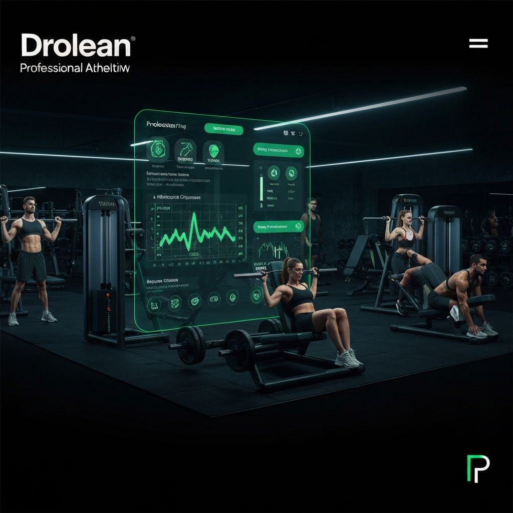

# Drolean - Plataforma de Entrenamiento Personal

Una plataforma fitness moderna construida con Next.js, siguiendo métodos formales de desarrollo para garantizar calidad, seguridad y escalabilidad.

## Características

- **Landing Page Futurista**: Diseño moderno con animaciones Framer Motion
- **Anamnesis Interactiva**: Formulario multi-paso con validación formal y state machine
- **PWA (Progressive Web App)**: Instalable, con funcionalidad offline
- **Integración con Supabase**: Backend robusto con Row Level Security (RLS)
- **WhatsApp Integration**: Contacto directo con los clientes
- **TypeScript Strict**: Tipado fuerte para prevenir errores
- **Arquitectura Desacoplada**: Frontend/Backend independientes

## Stack Tecnológico

- **Framework**: Next.js 16 (App Router)
- **UI**: React 19 + Tailwind CSS v4
- **Animaciones**: Framer Motion
- **Base de Datos**: Supabase (PostgreSQL)
- **Autenticación**: Supabase Auth (futuro)
- **Deployment**: Vercel
- **Tipado**: TypeScript

## Estructura del Proyecto

\`\`\`
drolean/
├── app/                    # Next.js App Router
│   ├── page.tsx           # Landing page
│   ├── anamnesis/         # Formulario de anamnesis
│   ├── offline/           # Página offline (PWA)
│   └── layout.tsx         # Layout principal
├── components/            # Componentes React
│   ├── anamnesis/        # Componentes del formulario
│   ├── ui/               # Componentes shadcn/ui
│   ├── header.tsx
│   ├── hero-section.tsx
│   └── ...
├── lib/                   # Utilidades y lógica
│   ├── types/            # TypeScript interfaces
│   ├── validations/      # Validaciones formales
│   ├── supabase/         # Cliente Supabase
│   └── storage/          # Capa de persistencia
├── scripts/               # Scripts SQL
│   ├── 001-create-anamnesis-table.sql
│   └── 002-create-rls-policies.sql
├── public/               # Assets estáticos
│   ├── manifest.json     # PWA manifest
│   └── sw.js            # Service Worker
└── SUPABASE_SETUP.md    # Guía de configuración
\`\`\`

## Instalación

1. **Clonar el repositorio**:
\`\`\`bash
git clone https://github.com/tu-usuario/drolean.git
cd drolean
\`\`\`

2. **Instalar dependencias**:
\`\`\`bash
npm install
\`\`\`

3. **Configurar variables de entorno**:
\`\`\`bash
cp .env.example .env.local
\`\`\`

Edita `.env.local` con tus credenciales:
\`\`\`env
NEXT_PUBLIC_SUPABASE_URL=tu-url-supabase
NEXT_PUBLIC_SUPABASE_ANON_KEY=tu-anon-key
NEXT_PUBLIC_WHATSAPP_NUMBER=1234567890
\`\`\`

4. **Configurar Supabase**:
Sigue las instrucciones en [SUPABASE_SETUP.md](./SUPABASE_SETUP.md)

5. **Ejecutar en desarrollo**:
\`\`\`bash
npm run dev
\`\`\`

Abre [http://localhost:3000](http://localhost:3000)

## Deployment

### Vercel (Recomendado)

1. Conecta tu repositorio a Vercel
2. Configura las variables de entorno
3. Deploy automático en cada push

### Manual

\`\`\`bash
npm run build
npm run start
\`\`\`

## Métodos Formales Aplicados

Este proyecto implementa métodos formales para garantizar calidad:

### 1. Especificación Formal
- **TypeScript Interfaces** para todos los datos
- **Criterios de aceptación** claros para cada funcionalidad
- **State Machine** para el formulario (idle → filling → validating → submitting → success/error)

### 2. Validaciones en Capas
- **Frontend**: Validación inmediata con feedback visual
- **Tipos**: TypeScript previene errores en tiempo de desarrollo
- **Backend**: Row Level Security (RLS) en Supabase

### 3. Seguridad (STRIDE Model)
- **Spoofing**: Prevención con Supabase Auth
- **Tampering**: RLS policies para proteger datos
- **Information Disclosure**: Encriptación HTTPS
- **DoS**: Rate limiting (planificado)
- **Elevation of Privilege**: Políticas de acceso estrictas

### 4. Arquitectura Limpia
\`\`\`
UI (React) → Casos de Uso (Validaciones) → Interfaces (API) → Entidades (DB)
\`\`\`

## Pruebas

\`\`\`bash
# Ejecutar todas las pruebas
npm test

# Cobertura
npm test -- --coverage

# Watch mode
npm test -- --watch
\`\`\`

## Roadmap

- [x] Fase 1: MVP - Landing + Anamnesis + Supabase
- [ ] Fase 2: Autenticación de clientes
- [ ] Fase 3: Panel de rutinas personalizadas
- [ ] Fase 4: Sistema de pagos (Stripe)
- [ ] Fase 5: App móvil nativa (React Native)

## Contribuir

1. Fork el proyecto
2. Crea una rama (`git checkout -b feature/nueva-funcionalidad`)
3. Commit tus cambios (`git commit -m 'Agregar nueva funcionalidad'`)
4. Push a la rama (`git push origin feature/nueva-funcionalidad`)
5. Abre un Pull Request

## Licencia

MIT License - ver [LICENSE](LICENSE)

## Contacto

- **Email**: contacto@drolean.com
- **WhatsApp**: +1234567890
- **Website**: https://drolean.com

---

Construido con métodos formales y las mejores prácticas de desarrollo web.
